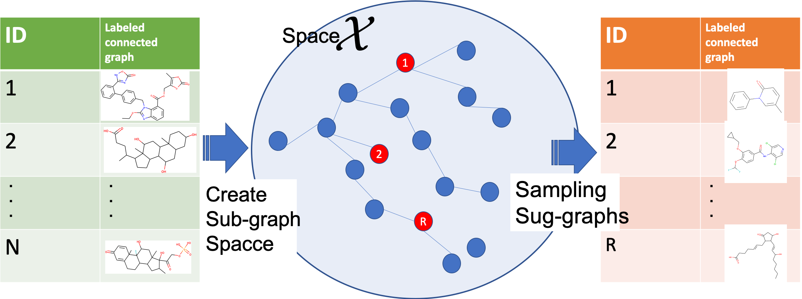

Graph random sampling
====

C++ source of graph random smpling algorithm
<div align="center">
    
</div>


## Description
- Input : Connected labeled Graph database
- Output : Conndecte labeled Random graphs

Implementation of random graph sampling algorith. 
Sampling Flow
- This program gets the connected graph DB
- Create space. There are unduplicated sub-graphs in graph DB.
- Sampling with uniform probability

WARNING : This is NOT Uniform sampling from "ALL" Subgraph Space. The lexical order of the first set of graph labels causes a bias in the order of visits to the sampling space.  


## Requirement
I have checked it under this environment.

Ubunts 7.3.0
- GNU Make 3.81
- gcc 7.3.0

## Install
`$ git clone --recurse-submodules git@github.com:se-z/graph-random-sampling.git`

## Settings
Experimental setting is writtern in toml file in /settings directory.
- data_path : DB's directory path
- struct_file_name : sampling space X
- random_graph_num : samping size of random graph 
- random_graph_max_size : max size of random graph. If you set 3, number of edge of graph is under 3.
- random_graph_under_size :  min size of random graph. 
- random_graph_uniform_sampling_parameter : the uniform parameter of sampling probability. 

Default setting are follows.
```
data_path = "./demo-data"
struct_file_name = "0.xsdf"
min_sup = 2
random_graph_num = 100
random_graph_max_size = 4
random_graph_under_size = 2
random_graph_uniform_sampling_parameter = 0.1
```

## Demo 

```
$ cd ./src
$ make
$ cd ../
$ ./src/run -a ./settings/test.toml
```

## Others
Output datastructre is DFS Code. It expresses a connected labeled graph.

```
v 0 3
v 1 8
v 2 3
e 0 1 1
e 1 2 1
```

- v arg1 arg2
    - vertex information
        - arg1 : vertex id
        - arg2 : vertex label. 
- e arg1 arg2 arg3
    - edge information
        - arg1 : from vertex id 
        - arg2 : to vertex id 
        - arg3 : edge label


## Author
[hanekichi++](https://github.com/se-z)
